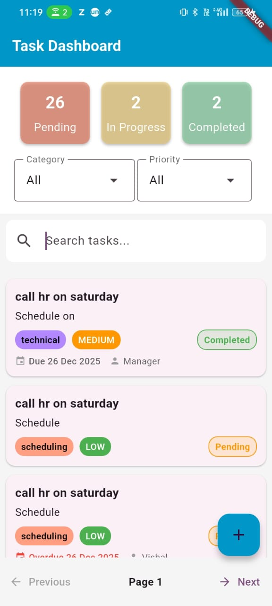
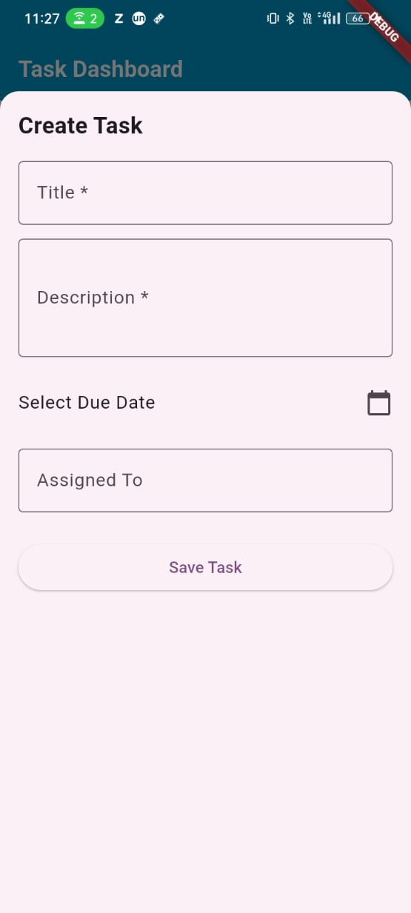
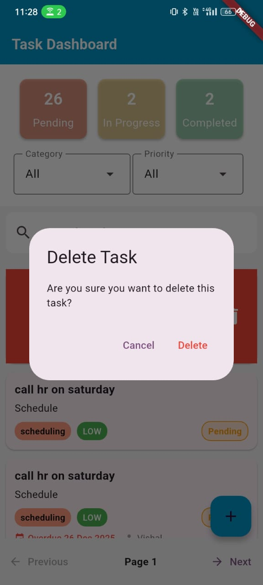

# Smart Task Manager

## 1. Project Overview

Smart Task Manager is a full‑stack task management system built as part of the Backend + Flutter Hybrid Developer Assessment.
The goal of the project is to provide a clean, scalable, and production‑ready solution for managing tasks with real‑world requirements such as pagination, filtering, search, summary dashboards, and full CRUD support. The backend exposes REST APIs, while the frontend is a Flutter mobile application consuming these APIs.

This project demonstrates:

- API design and validation
- State management and pagination handling
- Clean separation of concerns
- User‑friendly mobile UI with modern UX patterns

---

## 2. Tech Stack

### Backend

- **Node.js** – Runtime environment
- **_Express.js_** – REST API framework
- **_Supabase_** (PostgreSQL) – Database
- **_Zod_** – Request validation
- **_Swagger_** (swagger‑jsdoc, swagger‑ui‑express) – API documentation
- **_dotenv_** – Environment configuration

### Frontend

- **_Flutter_** – Mobile application framework
- **_Riverpod_** – State management
- **_Dio_** – HTTP client
- **_Material UI_** – UI components

---

## 3.Setup Instructions

### 🔹 Backend Setup

```
# Clone repository
git clone <repository-url>
cd backend


# Install dependencies
npm install

# Create .env file
PORT=5000
SUPABASE_URL=your_supabase_url
SUPABASE_ANON_KEY=your_supabase_anon_key


# Start server
npm run dev
```

Backend will run at:

Local

```
http://localhost:5000
```

Production (Render)

```
https://task-manager-bnaq.onrender.com
```

### 🔹 Flutter App Setup

```
flutter pub get
flutter run
```

Update API base URL and Supabase key in:

```
AppConstant.baseUrl
AppConstant.supabaseAnonKey
```

---

## 📁 Project Structure - Backend

```text
backend/
│── src/
│   ├── app.js                     # Express app configuration
│   ├── server.js                  # Server entry point
│
│   ├── config/
│   │   └── supabase.js            # Supabase client setup
│
│   ├── controllers/
│   │   └── task.controller.js     # API controllers
│
│   ├── routes/
│   │   └── task.routes.js         # API routes
│
│   ├── services/
│   │   └── task.service.js        # Business logic
│
│   ├── middlewares/
│   │   ├── error.middleware.js    # Global error handler
│   │   └── validate.middleware.js # Request validation
│
│   ├── validations/
│   │   └── task.validation.js     # Task validation schemas
│
│   ├── utils/
│   │   └── classifier.js          # Auto classification logic
│
│   └── testClassifier.js          # Classifier testing utility
│
│── .env
│── package.json
│── README.md
```

---

## 📁 Project Structure - Flutter (Frontend)

```text
lib/
│
├── main.dart
│   └── Application entry point
│
├── features/
│   │
│   ├── cors/
│   │   ├── constants.dart
│   │   │   └── API base URL, Supabase keys, app constants
│   │   │
│   │   └── dio_provider.dart
│   │       └── Dio configuration (base options, headers, timeouts)
│   │
│   ├── home/
│   │   ├── Widgets/
│   │   │   ├── top_section.dart
│   │   │   │   └── Status cards (Pending / In Progress / Completed)
│   │   │   │      Category & Priority dropdowns
│   │   │
│   │   │   ├── middle_section.dart
│   │   │   │   └── Task list, search, pagination, swipe-to-delete
│   │   │
│   │   │   ├── bottom_section.dart
│   │   │   │   └── Task creation/edit bottom sheet
│   │   │
│   │   │   └── task_skeleton.dart
│   │   │       └── Skeleton loaders for task list
│   │   │
│   │   └── home_screen.dart
│   │       └── Main screen combining top, middle & bottom sections
│   │
│   ├── task_filter_provider.dart
│   │   └── Category, priority, status & search providers
│   │
│   ├── task_model.dart
│   │   └── Task data model
│   │
│   ├── task_api.dart
│   │   └── API methods (GET, POST, PATCH, DELETE tasks)
│   │
│   ├── task_api_provider.dart
│   │   └── Provider wrapper for TaskApi
│   │
│   └── task_provider.dart
│       └── Riverpod StateNotifier handling:
│          - Task list
│          - Pagination
│          - Summary counts
│          - Create / Edit / Delete
│

```

## 4. API Documentation

### Base URL

```
http://localhost:5000
```

### Task APIs

| Method | Endpoint         | Description                           |
| ------ | ---------------- | ------------------------------------- |
| GET    | `/api/tasks`     | Fetch tasks with pagination & filters |
| GET    | `/api/tasks/:id` | Get task by ID                        |
| POST   | `/api/tasks`     | Create a new task                     |
| PATCH  | `/api/tasks/:id` | Update task                           |
| DELETE | `/api/tasks/:id` | Delete task                           |

### Example – Get Tasks

**GET** `/api/tasks?limit=10&offset=0&status=pending`

Response

```
{
  "data": [
    {
      "id": "dc12dd9d-8779-4a36-8eed-750dca0ef292",
      "title": "call hr on saturday",
      "description": "Schedule on",
      "category": "technical",
      "priority": "medium",
      "status": "completed",
      "assigned_to": "Manager",
      "due_date": "2025-12-26T13:00:00",
      "extracted_entities": {
        "actions": [
          "schedule",
          "call"
        ]
      },
      "suggested_actions": [
        "Block calendar",
        "Send invite",
        "Prepare agenda",
        "Set reminder"
      ],
      "created_at": "2025-12-26T09:57:55.572335",
      "updated_at": "2025-12-26T09:57:55.572335"
    },
    .......
  ],
  "meta": {
    "total": 31,
    "limit": "10",
    "offset": "0",
    "hasMore": true
  },
  "summary": {
    "pending": 27,
    "in_progress": 2,
    "completed": 2
  }
}
```

**GET** `/api/tasks/:id`

Response

```
{
  "id": "dfc88cea-e1db-43d9-9bfa-6acc3c0b63db",
  "title": "Urgent meeting today",
  "description": "Schedule meeting with finance team",
  "category": "scheduling",
  "priority": "high",
  "status": "pending",
  "assigned_to": "Manager",
  "due_date": null,
  "extracted_entities": {
    "date": "today",
    "person": "finance team",
    "actions": [
      "schedule",
      "meet"
    ]
  },
  "suggested_actions": [
    "Block calendar",
    "Send invite",
    "Prepare agenda",
    "Set reminder"
  ],
  "created_at": "2025-12-27T13:24:13.408941",
  "updated_at": "2025-12-27T13:24:13.408941",
  "history": [
    {
      "id": "535e1ea1-af4a-4eb1-b6e1-c847a0950d22",
      "task_id": "dfc88cea-e1db-43d9-9bfa-6acc3c0b63db",
      "action": "created",
      "old_value": null,
      "new_value": {
        "id": "dfc88cea-e1db-43d9-9bfa-6acc3c0b63db",
        "title": "Urgent meeting today",
        "status": "pending",
        "category": "scheduling",
        "due_date": null,
        "priority": "high",
        "created_at": "2025-12-27T13:24:13.408941",
        "updated_at": "2025-12-27T13:24:13.408941",
        "assigned_to": "Manager",
        "description": "Schedule meeting with finance team",
        "suggested_actions": [
          "Block calendar",
          "Send invite",
          "Prepare agenda",
          "Set reminder"
        ],
        "extracted_entities": {
          "date": "today",
          "person": "finance team",
          "actions": [
            "schedule",
            "meet"
          ]
        }
      },
      "changed_by": null,
      "changed_at": "2025-12-27T13:24:14.162334"
    }
  ]
}
```

**POST** `/api/tasks`

Response

```
{
  "id": "dfc88cea-e1db-43d9-9bfa-6acc3c0b63db",
  "title": "Urgent meeting today",
  "description": "Schedule meeting with finance team",
  "category": "scheduling",
  "priority": "high",
  "status": "pending",
  "assigned_to": "Manager",
  "due_date": null,
  "extracted_entities": {
    "date": "today",
    "person": "finance team",
    "actions": [
      "schedule",
      "meet"
    ]
  },
  "suggested_actions": [
    "Block calendar",
    "Send invite",
    "Prepare agenda",
    "Set reminder"
  ],
  "created_at": "2025-12-27T13:24:13.408941",
  "updated_at": "2025-12-27T13:24:13.408941"
}
```

**PATCH** `/api/tasks/:id`

Response

```
{
  "id": "dfc88cea-e1db-43d9-9bfa-6acc3c0b63db",
  "title": "Urgent meeting today at 3 PM",
  "description": "Schedule meeting with finance team and technical team",
  "category": "scheduling",
  "priority": "high",
  "status": "pending",
  "assigned_to": "Manager",
  "due_date": null,
  "extracted_entities": {
    "date": "today",
    "person": "finance team",
    "actions": [
      "schedule",
      "meet"
    ]
  },
  "suggested_actions": [
    "Block calendar",
    "Send invite",
    "Prepare agenda",
    "Set reminder"
  ],
  "created_at": "2025-12-27T13:24:13.408941",
  "updated_at": "2025-12-27T13:24:13.408941"
}
```

**DELETE** `/api/tasks/:id`

Response

```

Deleted Succesfully

```

---

## 📌 Query Parameters (GET /api/tasks)

- `page` – Page number
- `limit` – Number of tasks per page
- `status` – Filter by task status
- `category` – Filter by category
- `priority` – Filter by priority

---

## 🧠 Automatic Task Classification

When a task is created:

- The system analyzes the **title** and **description**
- Automatically assigns:

  - **Category** (Scheduling, Finance, Technical, Safety, General)
  - **Priority** (High, Medium, Low)

- Classification is keyword-based and can be overridden by the user

---

## 📊 Pagination & Dashboard Counts

- Guest requests are limited to improve performance
- Total task count and status-wise counts are calculated independently
- This ensures accurate dashboard data without extra API endpoints

---

## 📘 Swagger API Documentation

Swagger UI is available at:

```

https://task-manager-bnaq.onrender.com/api-docs

```

You can:

- Explore all APIs
- View request/response schemas
- Test endpoints directly from the browser

---

## 🧪 Testing

- Use **Postman** or **Swagger UI**
- Validate pagination, filters, and auto classification
- `testClassifier.js` can be used to test keyword detection logic

---

# 6. Screenshots

### Home Screen (Task List & Summary)



### Create Task



### Edit Task


### Swipe to Delete



---

# 7. Architecture Decisions

- Single GET endpoint returns tasks + summary counts to reduce API calls
- limit + offset pagination for backend‑controlled paging
- Partial updates (PATCH) aligned with Zod optional schema
- Riverpod state management to keep pagination, filters, and counts consistent
- Skeleton loading instead of spinners for better UX
- Swipe‑to‑delete + confirmation to prevent accidental deletion

---

# 8. What I’d Improve With More Time

- Authentication and role‑based access
- Soft delete and restore tasks
- Offline caching in Flutter
- Unit & integration tests
- Web version of the frontend
- Analytics and audit logs

---

## 👤 Author

## Developed by **Kanchan Gore**

```

```
